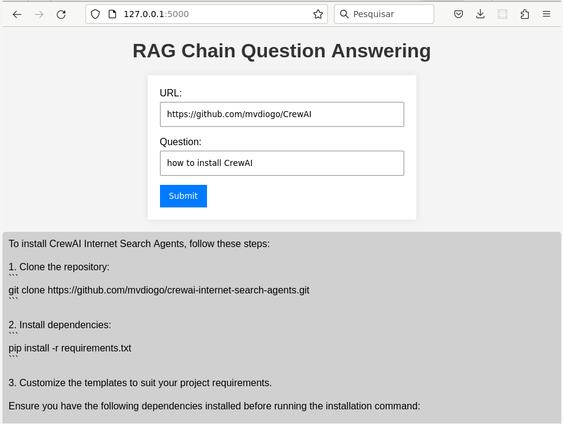

# RAG with Internet Browsing (Langchain, Flask and Ollama)

This project is a web page search application that uses Langchain for web page analysis and Ollama for answer generation. It is built with Flask and integrates with the Langchain and Ollama APIs.



## Installation

Before running the project, you need to install the required dependencies, including Ollama. Follow the steps below:

1. Install Ollama:

   - For Linux, run the following command in your terminal:

     ```bash
     curl https://ollama.ai/install.sh | sh
     ```

   - For macOS, download the Ollama project from [https://ollama.ai/download/Ollama-darwin.zip](https://ollama.ai/download/Ollama-darwin.zip).

2. Install Python dependencies:

   ```bash
   pip install -r requirements.txt
   ```

## Usage

1. Run the Flask application:

   ```bash
   python app.py
   ```

2. Open your web browser and navigate to [http://localhost:5000](http://localhost:5000).

3. Enter a URL and a question in the provided form and click "Submit."

4. The application will search the web page, analyze the content using Langchain, and generate an answer using Ollama.

## Dependencies

- Flask==3.0.1
- langchain==0.1.3
- langchain_community==0.0.17
- ollama==0.1.6

## License

This project is licensed under the [MIT License](LICENSE).
